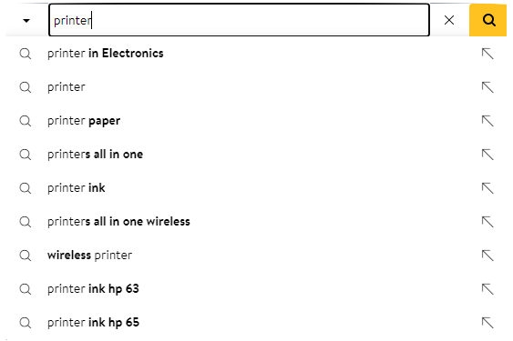
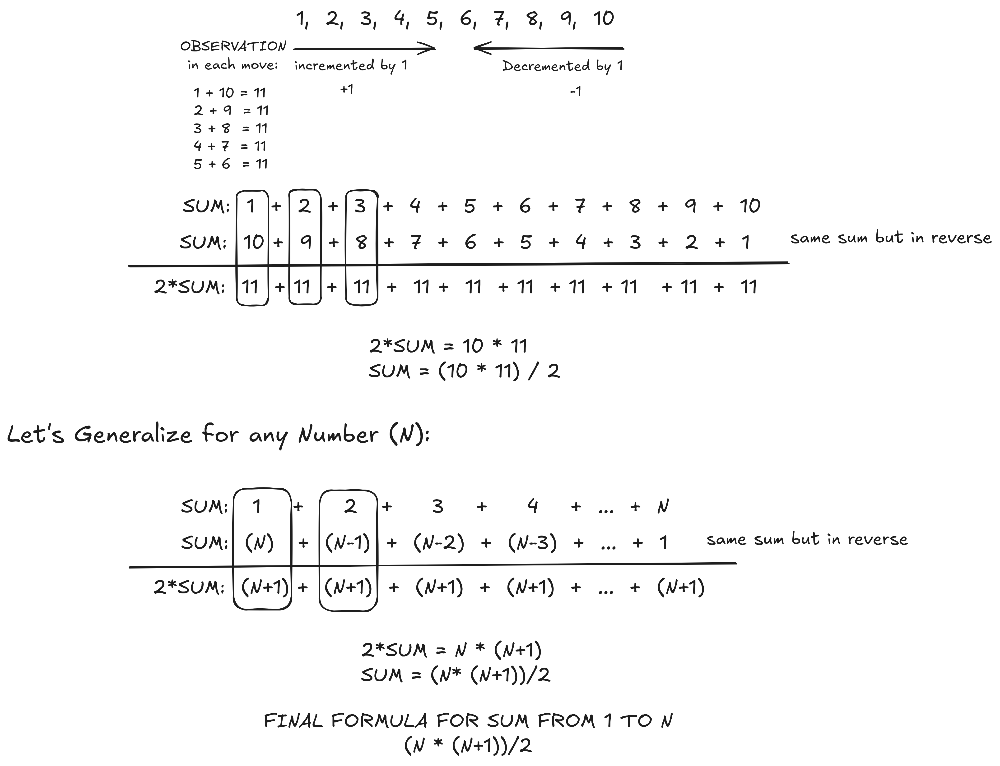
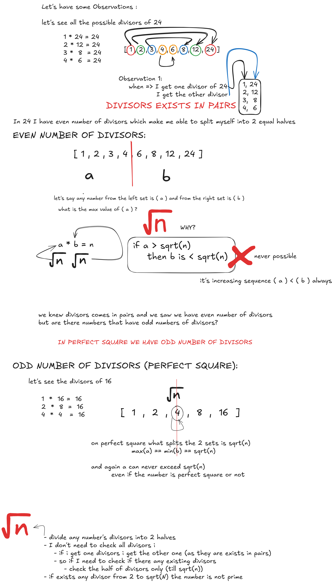
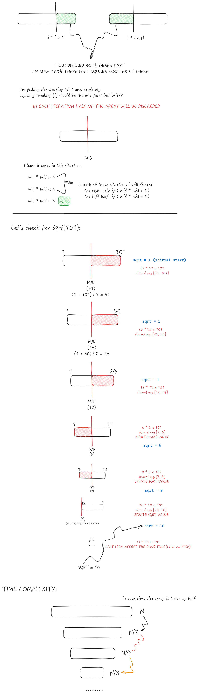

# 001 - Introduction to Problem Solving

## Content

- Terminologies
    - Algorithms
        > Steps you perform to complete a task or solve a problem\
        > Multiple algorithms possible to solve one particular problem (multiple solutions)
    - Data Structure
        > How we store and Organize our data\
        > __WHY?__ to make ease use of data and efficiency of working with it
- [Why Problem Solving ?](#why-problem-solving-?)
    - [Amazon use case](#amazon-use-case)
- First Steps Towards Problem Solving
    - Understanding the problem
    - Analyzing the problem
        - Building observations to solve the problem
- [Problems Discussed](#problems)
    - [Sum from 1 to N](#sum-from-1-to-n)
    - [check if a given number is prime or not](#check-if-the-given-number-is-prime)
    - [Calculating the square root of a number](#calculating-the-square-root-of-a-number)
- [General Discussions](#general-discussions)
    - [Dictionary](#dictionary)
- [Notes From Homework](#notes-from-homework)

## Why Problem Solving ?

Let's show the need of problem solving by discussing a simple use case overview if we want to replicate `Amazon.com` from tech point of view not buisness pov,\
Can I run my site as Amazon does and what problems i will encounter

### Amazon use case

Considering I am customer who want to buy something from Amazon what are the steps

1. Go to `Amazon.com`
    - __Problems__
        - Availability
            - Maintain the availability of my site in Scale or customers will leave my site and choose others
            - I need to maintain my site always on 24/7
        - Consistency
            
            - e.g. If we have 5 servers and 2 people across different cities look for particular product\
                the product is updated to be 50 % sale\
                we could face problem in consistency one server may not get the updated data\
                it will be unfair for all customers and leads to customer unsatisfied 

2. Search for a Product (Suggestion/ auto completion functionality)

    - __Problems__
        - Suggestion Latency (I need suggestions in ms)
        - Matching the name of the product with the suggestion
            - Accuracy of Suggestion

3. Filtering of the results based on parameters (e.g. Best seller, Cheapest, Popularity)
    - __Problems__
        - it's a sorting problem

4. We buy the product (Add To Cart -> Checkout -> make my  Payment)
    - __Problems__
        - Concurrency 
            - at one point multiple users try to access a limited resources
            - e.g. If we have 1 product and 2 people click add to cart at the same time\
                should both get the product ?!!

5. Order get delivered to me 
    - __Problems__
        - Amazon Must optimize the delivery cost and distribution (Optimization Problem)
            - if I have 100 product to ship should I send 100 delivery guy to ship them?\
            No, it's not scalable

## Problems
  
### Sum from 1 to N

__First approach (Brute force):__

Iterating from 1 to N and in each iteration increase the sum

```java
int sum = 0;

for (int i = 1; i <= N; i++)
    sum += i;
```

__Second approach:__

Let's see the power of observations, and making small observations can reduce the number of operations performed



### Check if the given number is prime

Prime number is number that is divisible by _exactly 2 divisors_ (`1` and the `number` itself)
- 1 is not prime because it has 1 divisor only 1

__First Approach (Brute force):__

Let's make some observations to solve this problem

1. If I have a number `N` can any number bigger than `N` divide it ? __NOT POSSIBLE__
    - All possible divisors of `N` lie in the  following range 

$$[1, .... , N]$$

2. We know that `1` and `N` are for sure divisors for any number `N`
    - so if there are any divisors from `2` to `N-1` the number won't be prime

```java
for (int i = 2; i < N; i++) {
    if (N % i == 0) {
        return false;
    }
}
return true;
```

We can do some optimization but it's constant time optimization not beneficial
- we can iterate from `2` to `N / 2` because it's the second biggest divisor after `N`

```java
for (int i = 2; i <= N / 2; i++)
//.....
```

Why it's not beneficial ? Let's check the approx number of steps if $N = 3 * 10^{6}$
- to check the number is prime will take $1.5 * 10^{6}$ steps which is not very beneficial

__Second Approach__



So the optimized code will be:

```java
for (int i = 2; i <= Math.sqrt(N); i++)
```

Or 

```java
for (int i = 2; i <= Math.pow(N, 1/2.0); i++)
```

But there is an issue in the previous codes `Math.sqrt()`, `Math,pow()` they are builtin function that do some work in each iteration and has complexity which will lead to overall an expensive operation

we can solve this issue by small math trick, __square each side of the comparison__.

```java
for (int i = 2; i * i <= N; i++) // be aware of overflow of (i * i)
```


### Calculating the square root of a number

We said in the previous problem that `sqrt()` could be expensive operation let's see why!!

__Basic Approach (Brute force):__

Let's see the steps to calculate the square root of the number N = 49

|iteration|  square of i |
|---------|--------------|
| $i = 1$ | $i * i = 1$  |
| $i = 2$ | $i * i = 4$  |
| $i = 3$ | $i * i = 9$  |
| $i = 4$ | $i * i = 16$ |
| $i = 5$ | $i * i = 25$ |
| $i = 6$ | $i * i = 36$ |
| $i = 7$ | $i * i = 49$ (which is the target) `STOP` |

The previous number was perfect square but what if not a perfect square (number doesn't have integer square root)

the maximum value $i$ such that: $i^2 <= N$ will be floor($\sqrt{N}$)

So if the previous $N = 48$ it will stop at $floor(\sqrt{N}) = 6$

```java
int sqrt = 1;
for (int i = 0; i * i <= N; i++)
    sqrt = i;
```

<br>

__Second Approach (Binary search):__

$$N = 400$$

Let's pick a random number e.g. 

| $i = 10$ | $(i * i = 100) < 400$ |
|----------|-----------------------|


Do I need to check any number less than 10, __NO__ any number in this range [1, 10] squaring it will always be less than 400 __DISCARD THEM__

If we say that $y$ is any number less than $i$ in the previous case

$$y < i$$
$$y^2 < i^2$$
$$\because i^2 < N$$
$$\therefore y^2 < i^2 < N$$
$$\therefore y^2 < N$$



$$N \Longrightarrow \frac{N}{2} \Longrightarrow \frac{N}{4} \Longrightarrow \frac{N}{8} \Longrightarrow \frac{N}{16} \Longrightarrow ... 1$$
$$\frac{N}{2^0} \Longrightarrow \frac{N}{2^1} \Longrightarrow \frac{N}{2^2} \Longrightarrow \frac{N}{2^3} \Longrightarrow \frac{N}{2^4} \Longrightarrow ....$$
$$step0 \Rightarrow step1 \Rightarrow step2 \Rightarrow step3 \Rightarrow step4 \Rightarrow ......$$

Let's assume if we have $k$ steps were taken for calculations

$$\frac{N}{2^k} = 1$$
$$2^k = N$$

- Let's take the $log_{2}$ for both sides

$$log_{2} (2^k) = log_{2} (N)$$
$$k*log_{2} (2) = log_{2} (N)$$
$$k = log_{2} (N)$$

- So it takes $log_{2} (N)$ Steps

But what does it mean I have log function
$$log_{2} (b) = x$$

It means what power of 2 should be raising to get b

$$(2^x = b) \Rightarrow  value\ of\ x\ ?\ to\ get\ b$$


## General Discussions 

### Dictionary

Property: all word are sorted \
If we want to search in it what algo should be used: __Binary Search__

But if I have a book that isn't sorted and I need to search for a word e.g. Velocity
- If i applied binary search
    - I need to sort the book then binary search it
    - __BUT I WILL DAMAGE THE STRUCTURE OR DATA OF THE BOOK__ not good choice

I can do something else $\Longrightarrow$ Go to the book once and keep track of the pages that the word happens

| word      |   pages  |
|-----------|----------|
| Velocity  | 2,30,9,1 |
|  Monkeys  |  1,200   |
| ........  | .........|

It's a key-value pair which is called __HASH MAP__ Data Structure

I didn't apply any algorithm but appreciating the power of data structure according to your use case will optimize a lot of things to us and allowing us to search us to search efficiently 

We will discuss more on depth on those algos and data structures that was just an overview


## Notes From Homework

- if we want to get (max element, min element, second max, second min)
    - don't first go to sort in your mind $O(n*log_{2} (n))$
    - you can iterate in the array one time and get that element $O(log_{2} (n))$
- Common Java functions:
    - `Integer.MIN_VALUE`, `Integer.MAX_VALUE`
    - `Math.abs()`
    - `Math.min()`, `Math,max()`
    - `Math.pow()`, `Math.sqrt()`
