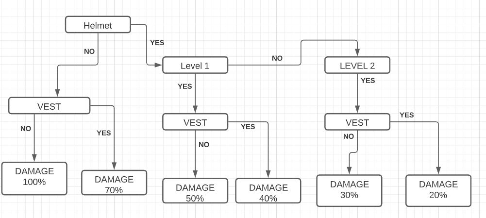
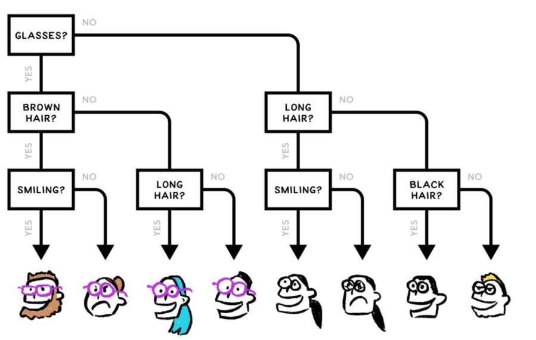

# Assignments

<a href="./damage-detection.txt">Damage detection</a>
 

You are having a Helmet of Level 1 and a VEST, what will be the damage?

<a href="./decision.txt">Decision</a>
 

The shape of a decision tree can make a big difference in what happens when you use it.

If your computer program is using this decision tree, how many questions, on average, will the computer program need to ask and answer in order to distinguish a random face?

<a href="./sqrt.txt">Find Sqrt</a>
 

You have to follow the following steps to find the sqrt of an integer N.

Consider L = 1, R = N, and cnt = 0

STEP 1: MID = (floor)(L+R)/2 and cnt += 1

STEP 2: if ((MID * MID) == N), then go to STEP 5 else go to STEP 3.

STEP 3: if ((MID * MID) < N), then L = MID+1 and go to STEP 1 else STEP 4.  

STEP 4: if ((MID * MID) > N), then R = MID - 1 and go to STEP 1.

STEP 5: PRINT MID.

 

If the value of N is 36, what will be the value of cnt?

